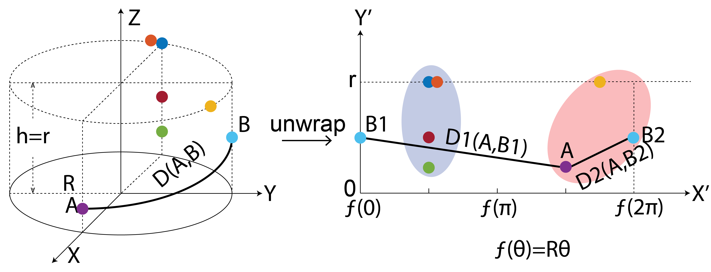

# Circular Clustering with Polar Coordinate Reconstruction

## Description

Current clustering schemes that work in a polar coordinate system have limitations, such as being only angle-focused or lacking generality. To overcome these limitations, we propose a new analysis framework that utilizes projections onto a cylindrical coordinate system to better represent objects in a polar coordinate system. Using the mathematical properties of circular data, our approach always finds the correct clustering result within the reconstructed dataset, given sufficient periodic repetitions of the data. Our approach is generally applicable and adaptable and can be incorporated into most state-of-the-art clustering algorithms. We demonstrate on synthetic and real data that our method generates more appropriate and consistent clustering results compared to standard methods.  

Example figure below shows how to reconstruct polar coordinates on the rectangular plane using cylindrical coordinates:

## Table of Contents

- [Installation](#installation)
- [Usage](#usage)
- [Features](#features)
- [Example Data](#example data)
- [License](#license)
- [Credits](#credits)
- [Contact](#contact)

## Installation

No further installation needed. Function files are directly runnable in Matlab. Work on any Matlab version with build-in functions for kmeans, dbscan, linkage. 

## Usage

Provided function file 'gmfp.m' and 'lmfp.m' that calculates the global/local mean field power from given EEG epoch. Corresponding python function has also been provided.   

## Features

- Feature 1: Two versions have been provided to run in both Matlab and Python. 
- Feature 2: Beginner Friendly. Examples in both enviroment have been provided (see [Matlab example](matlab/example.mlx) and [Python example](python/gmfp_example.ipynb) for details). 

## Example Data
dgsdgssfg

## License

This project is licensed under the [MIT License](https://opensource.org/licenses/MIT). Refer to the [LICENSE](LICENSE) file for more information.

## Credits

Thanks to Chongkun Zhao for working with me to put the code materials together.

This constitutes a segment of our branch's efforts within the closed-loop neuromodulation project (focused on phase entrainment). For a more comprehensive background, I encourage you to check out our series of publications.

simultaneous fMRI-EEG-TMS: https://www.sciencedirect.com/science/article/pii/S1935861X23017746

phase-locked closed-loop EEG-rTMS: https://www.sciencedirect.com/science/article/pii/S1935861X22000365

Clinic outcomes: https://papers.ssrn.com/sol3/papers.cfm?abstract_id=4334289

## Contact

For any inquiries or questions, you can reach me at [xiaoxiao.sun@columbia.edu]. Connect with me on [LinkedIn](https://www.linkedin.com/in/xiaoxiao-sun-b66012274/) for more updates and projects.

